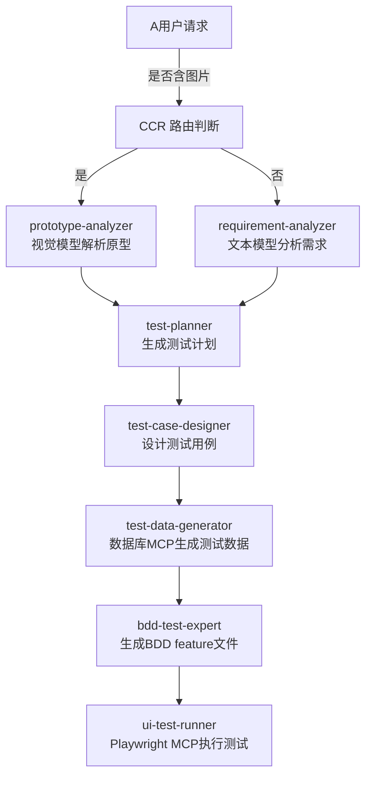

# 项目级 Subagent 配置 - 完整测试工作流

本目录包含了当前项目的完整软件测试工作流 Subagent 配置。

## 📊 完整工作流程图



## 🤖 已配置的 Subagent 列表

### 1. 🖼️ prototype-analyzer（原型解析员）
**文件**: `prototype-analyzer.md`

**用途**: 解析UI原型图，提取可测试需求

**模型**: `openrouter,anthropic/claude-3-opus-vision`（视觉模型）

**权限**: 无特殊工具权限

**输入**: UI原型图（图片）

**输出**: JSON格式的功能需求清单
```json
{
  "features": [
    {
      "name": "登录",
      "elements": ["用户名框", "密码框", "登录按钮"],
      "flows": ["输入→点击"]
    }
  ]
}
```

**使用示例**:
```bash
@prototype-analyzer 请分析这个登录页面原型
```

---

### 2. 📝 requirement-analyzer（需求分析员）
**文件**: `requirement-analyzer.md`

**用途**: 分析文本形式的测试需求，提取核心功能点

**模型**: `openrouter,anthropic/claude-3.5-sonnet`

**权限**: filesystem (read)

**技能**: requirement-analysis

**输入**: 自然语言需求描述

**输出**: 结构化需求文档
```json
{
  "requirement": {
    "feature": "功能名称",
    "objectives": ["目标1", "目标2"],
    "scope": {
      "in_scope": ["范围1"],
      "out_scope": ["排除范围"]
    },
    "acceptance_criteria": ["验收标准1"]
  }
}
```

**使用示例**:
```bash
@requirement-analyzer 分析用户登录功能的需求
```

---

### 3. 📋 test-planner（测试计划员）
**文件**: `test-planner.md`

**用途**: 根据需求文档制定全面的测试策略

**模型**: `openrouter,deepseek/deepseek-reasoner`（推理模型）

**权限**: filesystem (read, write)

**技能**: test-planning

**输入**: 需求文档

**输出**: 测试计划（包含策略、测试类型、环境、排期）
```json
{
  "test_plan": {
    "strategy": "测试策略描述",
    "test_types": [
      {"type": "功能测试", "priority": "高", "scope": "范围"}
    ],
    "environment": {
      "browsers": ["Chrome", "Firefox"],
      "devices": ["Desktop"]
    },
    "schedule": [
      {"phase": "阶段1", "tasks": ["任务1"], "duration": "估计时间"}
    ]
  }
}
```

**使用示例**:
```bash
@test-planner 为登录功能制定测试计划
```

---

### 4. 🎯 test-case-designer（测试用例设计师）
**文件**: `test-case-designer.md`

**用途**: 根据测试计划设计详细的测试用例

**模型**: `openrouter,anthropic/claude-3.5-sonnet`

**权限**: filesystem (read, write)

**技能**:
- test-case-design
- boundary-value-analysis（边界值分析）
- equivalence-partitioning（等价类划分）

**输入**: 测试计划

**输出**: 详细的测试用例集合
```json
{
  "test_cases": [
    {
      "id": "TC001",
      "title": "测试用例标题",
      "description": "详细描述",
      "preconditions": "前置条件",
      "steps": [
        {"step": 1, "action": "操作", "expected": "预期结果"}
      ],
      "test_data": "测试数据需求",
      "priority": "高",
      "type": "功能"
    }
  ]
}
```

**使用示例**:
```bash
@test-case-designer 为登录功能设计测试用例
```

---

### 5. 🔢 test-data-generator（测试数据生成器）
**文件**: `test-data-generator.md`

**用途**: 根据测试用例生成边界测试数据

**模型**: `openrouter,deepseek/deepseek-reasoner`

**权限**: database-mcp (read)

**技能**:
- boundary-value-analysis
- equivalence-partitioning

**输入**: 测试用例

**输出**: 测试数据集合（包含正常值、边界值、异常值）
```json
{
  "test_data": [
    {"username": "admin", "password": "Valid123!", "expected": "success"},
    {"username": "", "password": "short", "expected": "error_empty_username"}
  ]
}
```

**使用示例**:
```bash
@test-data-generator 为登录功能生成10组测试数据
```

---

### 6. 🥒 bdd-test-expert（Gherkin代码生成器）
**文件**: `bdd-test-expert.md`

**用途**: 将测试用例转换为标准的 Gherkin 语法

**模型**: `openrouter,anthropic/claude-3.5-sonnet`

**权限**: filesystem (read, write)

**技能**:
- cucumber-bdd
- gherkin-syntax

**输入**: 测试用例

**输出**: Gherkin 格式的 .feature 文件
```gherkin
Feature: 用户登录

  Scenario: 正常登录
    Given 用户在登录页面
    When 输入用户名 "admin" 和密码 "password123"
    And 点击登录按钮
    Then 应该跳转到首页
    And 显示欢迎消息
```

**使用示例**:
```bash
@bdd-test-expert 将TC001转换为Gherkin语法
```

---

### 7. 🎭 ui-test-runner（UI测试执行官）
**文件**: `ui-test-runner.md`

**用途**: 执行 Playwright UI 自动化测试

**模型**: `openrouter,anthropic/claude-3.5-sonnet`

**权限**: playwright-mcp (execute)

**技能**: cucumber-to-playwright

**输入**: Gherkin 测试脚本

**输出**: 测试执行结果
```
✅ 通过: 5/5
❌ 失败: 0
📸 截图: [链接]
📊 详细报告: test-results/login-report.html
```

**使用示例**:
```bash
@ui-test-runner 执行登录功能的UI测试（按Ctrl+B后台运行）
```

---

## ⚙️ 前置条件

### 1. CCR 全局路由配置
确保 `~/.claude-code-router/config.json` 包含以下 providers：

```json
{
  "Providers": [
    {
      "name": "openrouter",
      "api_base_url": "https://openrouter.ai/api/v1/chat/completions",
      "api_key": "${OPENROUTER_KEY}",
      "models": [
        "anthropic/claude-3-opus-vision",
        "anthropic/claude-3.5-sonnet",
        "deepseek/deepseek-reasoner"
      ]
    },
    {
      "name": "local-ollama",
      "api_base_url": "http://localhost:11434/v1/chat/completions",
      "api_key": "ollama",
      "models": ["qwen2.5-coder:latest"]
    }
  ],
  "Router": {
    "default": "openrouter,anthropic/claude-3.5-sonnet",
    "background": "local-ollama,qwen2.5-coder:latest",
    "think": "openrouter,deepseek/deepseek-reasoner"
  }
}
```

✅ **验证**: `ccr restart` → `ccr logs`

### 2. MCP 服务注册
编辑 `~/.claude/mcp.json` 添加：
```json
{
  "mcpServers": {
    "database-mcp": {
      "command": "npx",
      "args": ["-y", "@modelcontextprotocol/server-postgres"],
      "env": {
        "POSTGRES_CONNECTION_STRING": "${DATABASE_URL}"
      }
    },
    "playwright-mcp": {
      "command": "npx",
      "args": ["-y", "@executeautomation/playwright-mcp-server"],
      "env": {"HEADLESS": "true"}
    }
  }
}
```

✅ **验证**: `claude-code mcp list`

### 3. 环境变量配置
```bash
# .env 文件
OPENROUTER_KEY=sk-xxx
DATABASE_URL=postgresql://localhost:5432/testdb
```

---

## 🚀 完整工作流执行示例

### 场景1: 基于图片原型的测试

```bash
# 步骤1: 分析原型图
@prototype-analyzer 请分析这个登录页面原型图
# 输出: 功能需求清单

# 步骤2: 制定测试计划
@test-planner 根据需求清单制定测试计划
# 输出: 测试策略和排期

# 步骤3: 设计测试用例
@test-case-designer 根据测试计划设计详细的测试用例
# 输出: 完整的测试用例集合

# 步骤4: 生成测试数据
@test-data-generator 为TC001-TC010生成测试数据
# 输出: 10组测试数据

# 步骤5: 转换为Gherkin
@bdd-test-expert 将测试用例转换为.feature文件
# 输出: login.feature 文件

# 步骤6: 执行UI测试（后台运行）
@ui-test-runner 执行login.feature中的测试（Ctrl+B）
# 输出: 测试报告和截图
```

### 场景2: 基于文本需求的测试

```bash
# 步骤1: 分析需求文本
@requirement-analyzer 分析"用户需要能够通过用户名和密码登录系统"
# 输出: 结构化需求文档

# 步骤2-6: 同场景1
```

---

## 📁 配置文件结构

```
.claude/
├── agents/                          # Subagent 配置
│   ├── prototype-analyzer.md        # 原型解析员
│   ├── requirement-analyzer.md      # 需求分析员
│   ├── test-planner.md             # 测试计划员
│   ├── test-case-designer.md       # 测试用例设计师
│   ├── test-data-generator.md      # 测试数据生成器
│   ├── bdd-test-expert.md        # Gherkin生成器
│   ├── ui-test-runner.md           # UI测试执行官
│   └── README.md                   # 本文件
├── skills/                          # 技能库
│   ├── requirement-analysis.md
│   ├── test-planning.md
│   ├── test-case-design.md
│   ├── boundary-value-analysis.md
│   ├── equivalence-partitioning.md
│   └── cucumber-bdd.md
└── mcp/                             # MCP 服务配置
    ├── database-mcp.config.json
    ├── playwright-mcp.config.json
    └── README.md
```

---

## 🔍 验证与调试

| 验证项 | 命令/操作 | 预期结果 |
|-------|----------|---------|
| CCR 服务状态 | `ccr logs --tail 50` | 服务正常运行，无错误 |
| 模型注册检查 | `cat ~/.claude-code-router/config.json` | 所有模型已配置 |
| Subagent 配置 | `ls -la .claude/agents/` | 7个配置文件存在 |
| MCP 服务列表 | `claude-code mcp list` | 显示 database-mcp 和 playwright-mcp |
| MCP 连通性 | `claude-code mcp test database-mcp` | 连接成功 |
| Git 状态 | `git status` | `.claude/` 未被跟踪（符合预期） |

---

## 📝 注意事项

1. **权限最小化原则**
   - 只给 Subagent 必需的权限
   - 原型分析无需文件编辑权限
   - 测试数据生成只需数据库只读权限

2. **模型选择策略**
   - 视觉任务 → Claude Opus Vision
   - 推理任务 → DeepSeek Reasoner
   - 代码生成 → Claude 3.5 Sonnet
   - 后台任务 → 本地 Ollama 模型

3. **上下文隔离**
   - 每个 Subagent 有独立上下文
   - 避免测试数据污染主对话
   - 长任务使用后台执行（Ctrl+B）

4. **工作流编排**
   - 主对话负责整体编排
   - Subagent 负责专业产出
   - 前一步骤的输出是后一步骤的输入

---

## 🐛 常见问题

### Q1: Subagent 不工作
**A**: 检查以下项：
1. CCR 配置的模型是否与 Subagent 标签匹配
2. `~/.claude/` 或 `.claude/` 目录是否存在
3. Subagent 文件语法是否正确

### Q2: MCP 调用失败
**A**:
1. 验证 `~/.claude/mcp.json` 配置
2. 检查 MCP 包是否安装：`npm list -g @modelcontextprotocol/*`
3. 重启 Claude Code

### Q3: Git 不跟踪 `.claude/` 目录
**A**: 这是预期行为。如需提交配置，修改 `.gitignore`：
```gitignore
.claude/
!.claude/agents/
!.claude/skills/
!.claude/mcp/
```

---

## 📚 相关文档

- [MCP 配置指南](../mcp/README.md)
- [Skills 技能库](../skills/)
- [完整配置指南](../../docs/subagents-config.md)
- [测试工作流文档](../../docs/test-workflow.md)
- [项目结构说明](../../AGENTS.md)
