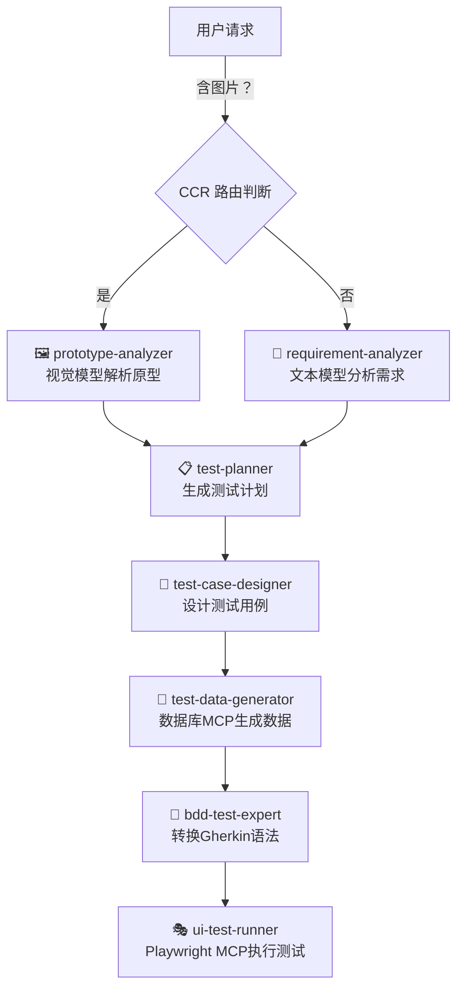

# 软件测试工作流 - 完整实施文档

本文档描述了基于 CCR Subagent 的完整软件测试自动化工作流。

## 📊 工作流概览



## 🎯 核心组件

### 1. Subagent（智能代理）

| Subagent | 模型 | 主要职责 | 输入 | 输出 |
|----------|------|---------|------|------|
| 🖼️ prototype-analyzer | Claude Opus Vision | UI原型图分析 | 原型图片 | 功能需求清单（JSON） |
| 📝 requirement-analyzer | Claude 3.5 Sonnet | 需求文本分析 | 需求描述 | 结构化需求文档 |
| 📋 test-planner | DeepSeek Reasoner | 测试计划制定 | 需求文档 | 测试策略和排期 |
| 🎯 test-case-designer | Claude 3.5 Sonnet | 测试用例设计 | 测试计划 | 详细测试用例 |
| 🔢 test-data-generator | DeepSeek Reasoner | 测试数据生成 | 测试用例 | 测试数据集 |
| 🥒 bdd-test-expert | Claude 3.5 Sonnet | Gherkin代码生成 | 测试用例 | .feature文件 |
| 🎭 ui-test-runner | Claude 3.5 Sonnet | UI测试执行 | Gherkin脚本 | 测试报告和截图 |

### 2. Skills（专业技能库）

| Skill | 描述 | 使用者 |
|-------|------|--------|
| requirement-analysis | 需求分析方法论 | requirement-analyzer |
| test-planning | 测试计划制定 | test-planner |
| test-case-design | 测试用例设计 | test-case-designer |
| boundary-value-analysis | 边界值分析 | test-case-designer, test-data-generator |
| equivalence-partitioning | 等价类划分 | test-case-designer, test-data-generator |
| cucumber-bdd | BDD测试方法 | bdd-test-expert, ui-test-runner |

### 3. MCP 服务（扩展能力）

| MCP | 用途 | 权限 | 使用者 |
|-----|------|------|--------|
| database-mcp | 数据库操作 | read | test-data-generator |
| playwright-mcp | 浏览器自动化 | execute | ui-test-runner |

## 📁 完整目录结构

```
claude-code-router-ui/
├── .claude/                              # 项目级 Claude 配置
│   ├── QUICKSTART.md                     # 5分钟快速入门指南
│   ├── agents/                           # Subagent 配置目录
│   │   ├── README.md                     # Agents 使用说明
│   │   ├── prototype-analyzer.md         # 🖼️ 原型解析员
│   │   ├── requirement-analyzer.md       # 📝 需求分析员
│   │   ├── test-planner.md              # 📋 测试计划员
│   │   ├── test-case-designer.md        # 🎯 测试用例设计师
│   │   ├── test-data-generator.md       # 🔢 测试数据生成器
│   │   ├── bdd-test-expert.md         # 🥒 Gherkin生成器
│   │   └── ui-test-runner.md            # 🎭 UI测试执行官
│   ├── skills/                           # 技能库目录
│   │   ├── requirement-analysis.md       # 需求分析技能
│   │   ├── test-planning.md             # 测试计划技能
│   │   ├── test-case-design.md          # 测试用例设计技能
│   │   ├── boundary-value-analysis.md   # 边界值分析技能
│   │   ├── equivalence-partitioning.md  # 等价类划分技能
│   │   └── cucumber-bdd.md              # BDD测试技能
│   └── mcp/                              # MCP 配置目录
│       ├── README.md                     # MCP 配置说明
│       ├── database-mcp.config.json      # 数据库MCP配置
│       └── playwright-mcp.config.json    # Playwright MCP配置
├── docs/                                 # 文档目录
│   ├── subagents-config.md              # Subagent配置指南
│   └── test-workflow.md                 # 测试工作流说明
└── AGENTS.md                             # 项目开发指南
```

## 🚀 完整实施步骤

### 阶段 1: 环境准备（一次性）

#### 1.1 安装基础软件
```bash
# Node.js (v18+)
node --version

# Claude Code Router
npm install -g claude-code-router

# PostgreSQL (或其他数据库)
sudo apt install postgresql  # Linux
brew install postgresql      # macOS
```

#### 1.2 配置 CCR 路由
```bash
# 编辑 ~/.claude-code-router/config.json
{
  "Providers": [
    {
      "name": "openrouter",
      "api_base_url": "https://openrouter.ai/api/v1/chat/completions",
      "api_key": "${OPENROUTER_KEY}",
      "models": [
        "anthropic/claude-3-opus-vision",
        "anthropic/claude-3.5-sonnet",
        "deepseek/deepseek-reasoner"
      ]
    }
  ],
  "Router": {
    "default": "openrouter,anthropic/claude-3.5-sonnet",
    "think": "openrouter,deepseek/deepseek-reasoner"
  }
}

# 启动服务
ccr restart
ccr logs
```

#### 1.3 配置 MCP 服务
```bash
# 编辑 ~/.claude/mcp.json
{
  "mcpServers": {
    "database-mcp": {
      "command": "npx",
      "args": ["-y", "@modelcontextprotocol/server-postgres"],
      "env": {
        "POSTGRES_CONNECTION_STRING": "postgresql://localhost:5432/testdb"
      }
    },
    "playwright-mcp": {
      "command": "npx",
      "args": ["-y", "@executeautomation/playwright-mcp-server"],
      "env": {"HEADLESS": "true"}
    }
  }
}

# 安装依赖
npx playwright install
```

### 阶段 2: 项目配置（每个项目一次）

#### 2.1 复制配置文件
```bash
# 配置已在项目中创建
ls -la .claude/agents/
ls -la .claude/skills/
ls -la .claude/mcp/
```

#### 2.2 验证配置
```bash
# 检查 CCR
ccr logs --tail 20

# 检查 MCP
claude-code mcp list
```

### 阶段 3: 执行测试工作流（每个功能）

#### 场景 A: 基于图片原型的测试

```bash
# 在 Claude Code 中执行：

# 步骤 1: 分析原型图
@prototype-analyzer [上传原型图]
# → 输出: {"features": [{"name": "登录", "elements": [...]}]}

# 步骤 2: 制定测试计划
@test-planner 根据需求制定测试计划
# → 输出: {"test_plan": {...}}

# 步骤 3: 设计测试用例
@test-case-designer 设计详细测试用例，包括边界场景
# → 输出: {"test_cases": [...]}

# 步骤 4: 生成测试数据
@test-data-generator 生成测试数据
# → 输出: {"test_data": [...]}

# 步骤 5: 转换为Gherkin
@bdd-test-expert 转换为.feature文件
# → 输出: Feature: ... Scenario: ...

# 步骤 6: 执行测试
@ui-test-runner 执行测试 (Ctrl+B)
# → 输出: ✅ 通过: 5/5, 📸 截图
```

#### 场景 B: 基于文本需求的测试

```bash
# 步骤 1: 分析需求
@requirement-analyzer 分析"用户登录功能需求..."
# → 输出: {"requirement": {...}}

# 步骤 2-6: 同场景 A
```

## 🎨 工作流特性

### 1. 智能路由
- **图片输入** → 自动使用视觉模型（Claude Opus Vision）
- **文本输入** → 自动使用文本模型（Claude 3.5 Sonnet）
- **推理任务** → 自动使用推理模型（DeepSeek Reasoner）

### 2. 上下文隔离
- 每个 Subagent 拥有独立上下文
- 避免数据污染和干扰
- 支持并行执行

### 3. 权限控制
- 原型分析：无文件操作权限
- 需求分析：只读权限
- 测试执行：执行权限
- 数据生成：数据库只读权限

### 4. 可扩展性
- 添加新 Subagent：创建 `.md` 文件
- 添加新 Skill：创建技能文件
- 添加新 MCP：注册服务

## 📊 输出产物

### 1. 需求阶段
```json
{
  "requirement": {
    "feature": "用户登录",
    "objectives": ["验证用户身份", "保护系统安全"],
    "scope": {
      "in_scope": ["用户名密码登录", "错误提示"],
      "out_scope": ["第三方登录", "多因素认证"]
    }
  }
}
```

### 2. 计划阶段
```json
{
  "test_plan": {
    "strategy": "黑盒测试 + 边界值分析",
    "test_types": [
      {"type": "功能测试", "priority": "P0", "count": 15},
      {"type": "界面测试", "priority": "P1", "count": 8}
    ],
    "environment": {
      "browsers": ["Chrome", "Firefox"],
      "test_data": "边界值 + 异常值"
    }
  }
}
```

### 3. 用例阶段
```json
{
  "test_cases": [
    {
      "id": "TC001",
      "title": "正常登录",
      "steps": [
        {"step": 1, "action": "输入有效用户名", "expected": "显示用户名"},
        {"step": 2, "action": "输入有效密码", "expected": "显示密码掩码"},
        {"step": 3, "action": "点击登录", "expected": "跳转首页"}
      ]
    }
  ]
}
```

### 4. 数据阶段
```json
{
  "test_data": [
    {"username": "admin", "password": "Valid123!", "expected": "success"},
    {"username": "", "password": "pass", "expected": "error_empty_username"},
    {"username": "admin", "password": "short", "expected": "error_invalid_password"}
  ]
}
```

### 5. 代码阶段
```gherkin
Feature: 用户登录

  Scenario: 正常登录
    Given 用户在登录页面
    When 输入用户名 "admin" 和密码 "Valid123!"
    And 点击登录按钮
    Then 应该跳转到首页
    And 显示欢迎消息
```

### 6. 执行阶段
```
✅ 通过: 15/15
❌ 失败: 0
⏱️ 耗时: 45s
📸 截图: test-results/screenshots/
📊 报告: test-results/report.html
```

## 🔍 验证与监控

### 实时监控命令
```bash
# CCR 服务状态
ccr logs --tail 50 --follow

# MCP 服务状态
claude-code mcp list

# 测试执行日志
tail -f test-results/login.log
```

### 健康检查
```bash
# 检查配置文件
cat ~/.claude-code-router/config.json | jq .
cat ~/.claude/mcp.json | jq .

# 检查数据库连接
psql -U postgres -c "SELECT version();"

# 检查 Playwright
npx playwright --version
```

## 🐛 故障排查

| 问题 | 可能原因 | 解决方案 |
|------|---------|---------|
| Subagent 无响应 | 模型未注册 | 检查 `config.json` 中的 `models` |
| MCP 调用失败 | 服务未启动 | 重启 Claude Code |
| 数据库连接失败 | 凭证错误 | 验证 `DATABASE_URL` |
| 测试执行超时 | 网络问题 | 检查目标 URL 可访问性 |
| 内存占用过高 | 上下文过大 | 清除缓存或分批执行 |

## 📚 相关资源

### 文档
- [快速入门指南](../.claude/QUICKSTART.md)
- [Subagent 配置指南](./subagents-config.md)
- [MCP 配置说明](../.claude/mcp/README.md)
- [Skills 技能库](../.claude/skills/)

### 外部资源
- [Claude Code 官方文档](https://docs.anthropic.com/claude-code)
- [CCR 路由器文档](https://github.com/example/claude-code-router)
- [Model Context Protocol](https://modelcontextprotocol.io/)
- [Cucumber BDD 指南](https://cucumber.io/docs/gherkin/)
- [Playwright 文档](https://playwright.dev/docs/intro)

## 🎓 最佳实践

### 1. 权限最小化
- 只给必需的权限
- 定期审查权限配置
- 使用 `permissionMode: require` 限制执行权限

### 2. 模型选择
- 视觉任务 → Vision 模型
- 推理任务 → Reasoner 模型
- 简单任务 → 基础模型（节省成本）

### 3. 上下文管理
- 长任务使用后台执行（Ctrl+B）
- 定期清理缓存
- 使用清晰的输入输出格式

### 4. 工作流优化
- 并行执行独立任务
- 缓存可重用的结果
- 监控和记录性能指标

## 🔮 未来扩展

### 计划中的功能
- [ ] API 测试 Subagent
- [ ] 性能测试 Subagent
- [ ] 安全测试 Subagent
- [ ] 移动端测试支持
- [ ] 测试报告可视化
- [ ] CI/CD 集成

### 贡献指南
欢迎提交 Pull Request 或 Issue 来改进这个工作流！

---

**文档版本**: 1.0.0
**最后更新**: 2025-01-29
**维护者**: Claude Code Router UI Team
