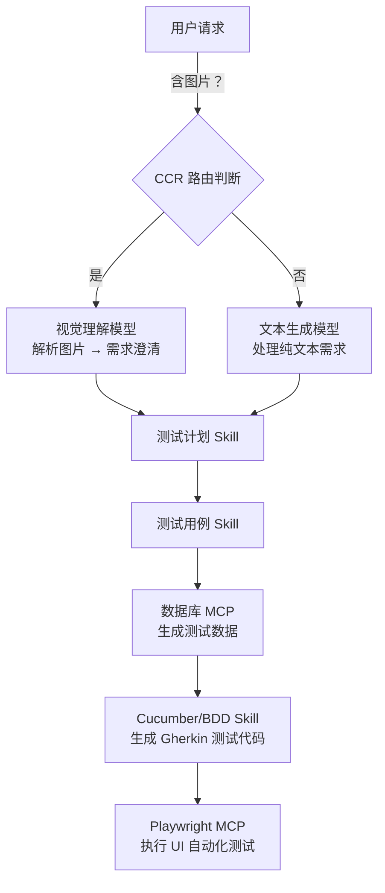

# 基于 **Claude Code Router（CCR）** 的多模型路由能力，结合 **Skills** 与 **MCP（Model Calling Protocol，模型调用协议）服务**，构建一个端到端的 **软件测试自动化工作流**。重点在于：**当用户输入包含原型图（图片）时，CCR 自动路由至视觉理解模型；其他阶段则使用文本生成、数据库查询、UI 自动化等专用 MCP 或 Skill**。

---

## ✅ 软件测试工作流整体架构（基于 CCR）



---

## 🔧 具体实施步骤（聚焦核心逻辑）

### 步骤 1：配置 CCR 的智能路由规则（关键！）

在 `claude-code-router` 的路由配置中定义：

```yaml
# ccr-routing.yaml
routes:
  - condition: has_image_in_request()
    target: vision-model   # 如 Claude 3 Opus Vision / GPT-4V
    skill: requirement_clarification_vision

  - condition: text_only_request() and contains_keywords(["test", "需求", "功能"])
    target: text-generation-model  # 如 Claude 3 Sonnet / GPT-4 Turbo
    skill: requirement_clarification_text

  - condition: stage == "test_plan"
    target: reasoning-model
    skill: test_plan_generator

  - condition: stage == "test_cases"
    target: structured-output-model
    skill: gherkin_test_case_generator

  - condition: stage == "test_data"
    target: mcp:database-query-service
    protocol: MCP

  - condition: stage == "ui_automation"
    target: mcp:playwright-service
    protocol: MCP
```

> 💡 **说明**：`has_image_in_request()` 是 CCR 内置的上下文感知函数，自动检测用户消息是否包含图像附件或 Base64 图片。

---

### 步骤 2：实现“需求澄清”阶段（支持图文混合）

#### 场景 A：用户上传原型图（如 Figma 截图、手绘草图）
- CCR 自动路由到 **视觉理解模型**
- 调用 `requirement_clarification_vision` Skill：
  ```python
  def requirement_clarification_vision(image, context=""):
      prompt = f"""
      你是一名资深测试分析师。请根据以下原型图，提取可测试的功能需求。
      要求：
      1. 识别页面元素（按钮、输入框、列表等）
      2. 推断用户操作流程
      3. 输出结构化需求列表（JSON 格式）
      """
      return vision_model.infer(image, prompt)
  ```

#### 场景 B：用户仅提供文字描述
- 路由到 **文本生成模型**
- 使用 `requirement_clarification_text` Skill 提取/澄清需求

> ✅ 输出统一为标准化 JSON，供下一阶段消费。

---

### 步骤 3：测试计划 → 测试用例（Skill 链式调用）

- **测试计划 Skill**：基于澄清后的需求，生成测试策略、范围、资源计划。
- **测试用例 Skill**：使用 **BDD 风格模板**，输出 Gherkin 语法（Given-When-Then）：
  ```gherkin
  Feature: 用户登录
    Scenario: 有效凭据登录成功
      Given 用户在登录页面
      When 输入有效的用户名和密码
      And 点击“登录”按钮
      Then 应跳转到仪表盘页面
  ```

> 🔄 CCR 在此阶段始终路由到 **擅长结构化输出的文本模型**（如 Claude 3 Haiku/Sonnet）。

---

### 步骤 4：测试数据生成（调用 Database MCP）

- 当工作流进入 `test_data` 阶段，CCR **不调用 LLM**，而是直接通过 **MCP 协议** 调用数据库服务：
  ```json
  // MCP 请求示例
  {
    "mcp_service": "postgres-test-data",
    "operation": "generate_test_users",
    "params": {
      "count": 10,
      "roles": ["admin", "user"],
      "include_invalid": true
    }
  }
  ```
- 返回结构化测试数据（如 CSV/JSON），注入到测试用例上下文中。

---

### 步骤 5：生成并执行 UI 自动化测试（Playwright MCP）

1. **Cucumber Skill** 将 Gherkin 用例 + 测试数据 → 转换为 Playwright 测试脚本（TypeScript/Python）
2. CCR 路由到 **Playwright MCP** 执行：
   ```json
   {
     "mcp_service": "playwright-runner",
     "script": "generated_login_test.spec.ts",
     "browser": "chromium",
     "headless": true,
     "report_format": "html"
   }
   ```
3. Playwright MCP 返回测试结果（通过/失败、截图、日志）

---

## 🧩 数据流与状态管理

- 使用 **上下文对象（Context）** 贯穿整个工作流：
  ```json
  {
    "workflow_id": "test-2026-01-28-001",
    "stage": "ui_automation",
    "requirements": { ... },
    "test_cases": [ ... ],
    "test_data": { ... },
    "automation_script": "..."
  }
  ```
- CCR 在每个阶段更新上下文，并决定下一跳目标。

---

## ✅ 优势总结

| 能力 | 实现方式 |
|------|--------|
| **图文混合输入处理** | CCR 自动检测图片 → 路由视觉模型 |
| **专业化分工** | 每个阶段使用最适合的模型/MCP |
| **无缝衔接** | 上下文传递 + 自动触发下一阶段 |
| **可扩展性** | 新增 Skill/MCP 只需更新路由规则 |

---